# HDR Merge And Image Alignment

This document describes the current HDR merge job and the image alignment step that now runs before accumulation.

Implementation files:

- `src/control/jobs/control_jobs.c`: HDR merge job, weighting, normalization, DNG write-out, integration of alignment.
- `src/common/hdr_alignment.h`: public alignment data structure and API.
- `src/common/hdr_alignment.c`: alignment estimation and CFA-aware warp application.

## Scope

The document covers two related pieces of functionality:

1. How darktable builds a merged HDR raw image from multiple bracketed raw frames.
2. How non-reference frames are geometrically aligned before being merged.

Current constraints:

- input must be raw, single-channel, `uint16` sensor data as exported through `rawprepare`
- all images must have identical dimensions and orientation
- alignment currently supports Bayer only
- output is written as a merged DNG based on the first image in the stack

## Part 1: How HDR Merge Works

### Overview

The HDR merge job processes a sequence of input images and accumulates them into two buffers:

- `pixels`: weighted radiometric sum
- `weight`: accumulated confidence / exposure weight per sensor sample

After all images have been processed, the accumulated sum is normalized by the total weight and by a stack-wide white level, then written as a DNG.

At a high level, the job does this:

1. Export each selected image through `rawprepare` into a floating-point raw mosaic.
2. Validate that the stack is compatible for merge.
3. Use the first image as the merge reference and output metadata source.
4. Optionally align each later image to the first image.
5. Compute a per-pixel merge weight from exposure and local saturation state.
6. Accumulate unclipped samples and handle saturated samples separately.
7. Normalize the final buffer.
8. Write a merged DNG and import it back into the library.

### Input Validation And Reference Frame

The first processed image initializes the merge state:

- image id of the reference frame
- Bayer / X-Trans layout used for DNG output
- image dimensions and orientation
- white-balance coefficients
- color matrix metadata
- accumulation buffers
- a copy of the first mosaic, which is also the alignment reference

The merge job rejects the stack if any later image:

- is not raw
- is not single-channel
- is not `uint16`
- differs in width or height
- differs in orientation

This is a hard constraint because the output is still a raw-domain merge, not a merge after demosaic or scene-referred resampling.

### Radiometric Calibration

For each input frame the code derives two important quantities from EXIF:

- a calibration factor `cal`
- a photon-count proxy `photoncnt`

Using aperture, exposure time, and ISO, the code computes

$$
\text{aperture area} = \pi \left(\frac{0.5 f}{N}\right)^2,
$$

$$
\mathrm{cal} = \frac{100}{\text{aperture area} \cdot t \cdot ISO},
$$

$$
\mathrm{photoncnt} = \frac{100 \cdot \text{aperture area} \cdot t}{ISO}.
$$

Interpretation:

- `cal` maps the input frame toward a common radiometric scale.
- `photoncnt` is used as a confidence prior: longer, brighter exposures contribute more where they are not clipped.

The merge state also tracks

$$
\text{whitelevel} = \max(\text{whitelevel}, \text{saturation} \cdot \mathrm{cal}),
$$

which is later used for final normalization.

### Merge Weighting

The initial merge weight for a sample is

$$
w = \mathrm{photoncnt}.
$$

That weight is then modulated by a local exposure envelope. The implementation does not decide clipping from a single pixel alone. Instead it inspects a conservative local neighborhood and computes:

- `M`: local maximum sample value
- `m`: local minimum sample value

The local maximum is fed into the envelope function `_envelope()` after a small offset:

$$
w \leftarrow w \cdot \left(\varepsilon_w + E\left(\frac{M + \text{offset}}{\text{saturation}}\right)\right),
$$

where `E(.)` is a smooth piecewise envelope and `\varepsilon_w` is a tiny floor.

The intent is:

- give high weight to well-exposed samples
- reduce weight near clipping
- still allow partially clipped neighborhoods to contribute if some channels remain useful

### Two Merge Regimes: Unclipped And Saturated

The merge logic separates the accumulation path into two cases.

#### Unclipped samples

If the local neighborhood is not considered saturated, the sample is accumulated normally:

$$
\mathrm{pixels}[k] \mathrel{+}= w \cdot in \cdot \mathrm{cal},
$$

$$
\mathrm{weight}[k] \mathrel{+}= w.
$$

This is the usual weighted merge path.

#### Saturated samples

If the local maximum indicates saturation, the sample is not added to the positive weighted sum. Instead the code keeps a fallback value only if no better unsaturated information has already been accumulated.

The logic uses negative `weight[k]` values as a marker that the pixel is currently backed by a saturation fallback instead of a proper weighted sum.

This encoding lets the merge logic represent two states in one array:

- `weight[k] > 0`: regular weighted accumulation exists
- `weight[k] <= 0`: only saturation fallback exists so far

If the entire local neighborhood is saturated, the fallback pixel may be forced to `1.0`. Otherwise the current sample is stored in a calibrated form relative to the stack white level.

This is a compact but slightly non-obvious part of the implementation.

### Interaction With Alignment

If alignment is enabled for the current image, the merge source is switched from the raw export buffer to an aligned temporary buffer.

Warped-out-of-bounds pixels are written as `-1.0f` sentinels. The merge loop checks for these sentinels and skips them:

- the center sample is ignored if it is out of bounds
- neighborhood extrema also skip out-of-bounds values

This prevents aligned edge padding from polluting the envelope or the final accumulation.

### Final Normalization

After all frames are processed, only pixels with positive accumulated weight are normalized:

$$
\mathrm{pixels}[k] \leftarrow \max\left(0, \frac{\mathrm{pixels}[k]}{\mathrm{whitelevel} \cdot \mathrm{weight}[k]}\right).
$$

This converts the accumulated sum back into a normalized raw-domain value that clips at `1.0` as expected by the DNG output path.

### Output And Metadata

The merged result is written as a DNG using metadata primarily derived from the first frame:

- filter layout
- X-Trans pattern if present
- white-balance coefficients
- camera color matrix
- EXIF blob adapted to the merged size

The output filename is derived from the first image by appending `-hdr.dng`.

After writing, darktable imports the new DNG and refreshes the collection view.

### Tradeoffs Of The Merge Design

Strengths:

- stays in the raw domain
- keeps sensor layout and camera metadata
- favors better exposed samples while preserving clipped fallback behavior
- avoids demosaic-before-merge artifacts

Weaknesses:

- merge weighting is heuristic rather than probabilistic
- saturation handling uses a compact but subtle negative-weight convention
- all frames must match exactly in geometry before merge, hence the need for alignment

## Part 2: How Image Alignment Works

### Goal

The alignment step attempts to register every non-reference image to the first image in the HDR stack before the merge weights are computed.

The current model is:

1. a global backward projective homography
2. plus a residual regularized `3x3` mesh in output space

This is a compromise between a simple rigid model and a dense local warp.

### When Alignment Runs

Alignment is integrated directly into `_control_merge_hdr_process()`:

- the first frame is copied into `ref_mosaic`
- later frames are aligned against `ref_mosaic`
- if alignment fails, the image is merged unaligned
- if the sensor is X-Trans, alignment is skipped entirely for now

The warp is only applied if the estimated transform differs meaningfully from identity.

### Design Objective And Motion Model Requirements

Before describing the alignment result type, it is useful to state what the alignment stage is trying to correct.

For HDR merge, the misalignment is usually caused by handheld capture between bracketed exposures. In practice this can include:

- image-plane translation
- small roll rotation
- weak perspective change from a slightly shifted viewpoint
- corner-local residual error that remains after a single global fit

The alignment stage is therefore not solving a completely general registration problem. It needs a motion model that is:

- expressive enough to remove visible blur across most of the frame, especially at the corners
- robust under exposure differences between bracketed frames
- cheap enough to run inside the HDR merge job
- conservative enough to avoid inventing strong local deformations on raw sensor data

In terms of geometry, the main design question is: which family of transforms is large enough to describe practical bracket misalignment, but still small enough to estimate reliably on raw-domain images?

Let the output pixel be

$$
x = \begin{bmatrix} x \\ y \end{bmatrix},
$$

and let the sampled source position be

$$
s = W(x; p) = \begin{bmatrix} s_x \\ s_y \end{bmatrix}.
$$

The transform families considered are the following.

#### (a) Translation, 2 DOF

Parameters:

$$
p = (t_x, t_y).
$$

Model:

$$
W_{trans}(x; p) =
\begin{bmatrix}
x + t_x \\
y + t_y
\end{bmatrix}.
$$

This corrects only lateral sensor-plane shift.

Why it is not enough:

- cannot model roll
- cannot model scale or shear
- leaves corner blur when the camera rotates slightly between shots

#### (b) Euclidean / rigid transform, 3 DOF

Parameters:

$$
p = (\theta, t_x, t_y).
$$

Model about the origin:

$$
W_{rigid}(x; p) =
\begin{bmatrix}
\cos\theta & -\sin\theta \\
\sin\theta & \cos\theta
\end{bmatrix}
\begin{bmatrix}
x \\
y
\end{bmatrix}
+
\begin{bmatrix}
t_x \\
t_y
\end{bmatrix}.
$$

In the implementation, the coarse initializer applies the equivalent transform around the image center.

What it adds over translation:

- corrects image-plane shift
- corrects roll rotation

Why it is still not enough:

- assumes no scale change
- assumes no shear
- assumes no perspective effect
- improved some stacks but remained too limited for many handheld brackets

#### (c) Similarity transform, 4 DOF

Parameters:

$$
p = (a, \theta, t_x, t_y),
$$

where $a$ is a uniform scale factor.

Model:

$$
W_{sim}(x; p) =
a
\begin{bmatrix}
\cos\theta & -\sin\theta \\
\sin\theta & \cos\theta
\end{bmatrix}
\begin{bmatrix}
x \\
y
\end{bmatrix}
+
\begin{bmatrix}
t_x \\
t_y
\end{bmatrix}.
$$

What it adds over rigid motion:

- uniform zoom in/out

Why it is still not enough:

- still cannot represent anisotropic scale or shear
- still cannot represent perspective convergence
- not a good match for the corner failures seen in practical HDR stacks

#### (d) Affine transform, 6 DOF

Parameters:

$$
p = (a_{00}, a_{01}, a_{02}, a_{10}, a_{11}, a_{12}).
$$

Model:

$$
W_{aff}(x; p) =
\begin{bmatrix}
a_{00} & a_{01} & a_{02} \\
a_{10} & a_{11} & a_{12}
\end{bmatrix}
\begin{bmatrix}
x \\
y \\
1
\end{bmatrix}.
$$

What it adds over similarity:

- anisotropic scale
- shear
- more general linear distortion

Why it is still not enough:

- affine transforms preserve parallel lines
- they cannot represent true projective effects from viewpoint change
- in practice, corner blur remained on stacks where weak perspective was present

#### (e) Homography / projective transform, 8 DOF

Parameters:

$$
p = (h_0, h_1, h_2, h_3, h_4, h_5, h_6, h_7),
$$

with implicit bottom-right element equal to $1$.

Model:

$$
W_{proj}(x; p) =
\begin{bmatrix}
\dfrac{h_0 x + h_1 y + h_2}{h_6 x + h_7 y + 1} \\
\dfrac{h_3 x + h_4 y + h_5}{h_6 x + h_7 y + 1}
\end{bmatrix}.
$$

What it adds over affine:

- perspective convergence
- the most general planar projective warp representable by one global transform

This is the current global model used by the HDR alignment code.

#### (f) Local / non-rigid warps

There is no single fixed parameter count here. The degrees of freedom depend on the parameterization: control mesh, spline coefficients, optical-flow field, or another local model.

One generic way to write a local warp is:

$$
W_{local}(x) =
\begin{bmatrix}
x \\
y
\end{bmatrix}
+
\begin{bmatrix}
u(x, y) \\
v(x, y)
\end{bmatrix},
$$

where $u(x, y)$ and $v(x, y)$ are spatially varying displacement fields.

What it adds over homography:

- can model parallax, lens mismatch, and scene-local deformation

Why it was not chosen as the primary model:

- more expensive to estimate and apply
- more likely to overfit low-texture raw data
- harder to keep stable under large exposure differences
- riskier for raw-domain processing because local distortions can create implausible geometry

### Why The Design Uses A Layered Approach

The alignment pipeline uses different motion models at different stages:

1. **ECC refinement** uses option (b), a native 3-DOF Euclidean model (rotation + translation). The optimizer builds its Hessian and Jacobian entirely in the $(\theta, t_x, t_y)$ parameter space, so no energy can leak into shear, scale, or perspective DOFs.

2. **Adaptive DOF escalation** (at an intermediate pyramid level): once the 3-DOF fit has been refined to a mid-resolution level (shortest edge ≥ `HDR_ALIGN_ESCALATION_MIN_DIM` = 512 px), the pipeline attempts chain escalation — first to option (d) 6-DOF affine, and only if that improves ρ, then to option (e) 8-DOF projective ECC. Each accepted step must pass improvement, conditioning, and sanity checks. If a step does not improve ρ, escalation stops and reverts to the last accepted model. Once a higher-DOF model is accepted, it is used for all remaining finer pyramid levels.

3. **Corner refinement** uses option (e), computing a local 4-point homography correction from NCC patches at the four image corners. This absorbs weak perspective and residual scale that the preceding ECC model did not capture.

4. **Mesh residuals** add a small amount of option (f) behavior via a regularized $3\times3$ local displacement grid.

The result is stored as an 8-DOF backward homography (the common representation used by corner refinement and the final warp). The core iterative optimizer starts with only 3 parameters per step and selectively escalates to 6 or 8 when the data supports it.

#### Why ECC starts with the Euclidean model

An earlier version of the code ran ECC with the full 8-DOF projective Jacobian. This worked adequately on easy stacks but failed systematically on difficult HDR brackets (e.g. very dark + very bright exposures). The failure mode was:

- gradient noise in the 8-DOF normal equations coupled rotation with shear and perspective
- the Gauss-Newton update drifted the off-diagonal and diagonal elements away from a valid rotation
- post-hoc clamping or projection back onto the Euclidean subspace did not help, because the 8×8 Hessian inverse had already mixed the DOFs

Projecting the 8-DOF solution back onto 3-DOF after solving is not equivalent to natively solving 3-DOF. The 8×8 Hessian inverse couples all 8 parameters, so the projected update direction is contaminated by the 5 excess DOFs.

The native 3-DOF solver eliminates this problem entirely: the 3×3 Hessian only has Euclidean directions, so every update is guaranteed to stay on the rigid-body manifold.

The adaptive DOF escalation then introduces higher-DOF models at an intermediate pyramid level (shortest edge ≥ 512 px), using chain escalation: starting from the stable 3-DOF solution, it first tries 6-DOF affine; if that improves ρ, it tries 8-DOF projective from the 6-DOF result; if any step does not improve, escalation stops and keeps the last accepted model. Once accepted, the higher-DOF model is used for all remaining finer levels, continuously refining the extra parameters (scale, shear, perspective) at increasing resolution. This avoids the instability problems of running higher-DOF ECC from the coarsest levels while still capturing perspective and scale corrections when the data supports them. Moving escalation to mid-pyramid (instead of only at the finest level) significantly reduces computation cost since the escalation solver runs on a smaller image, while still providing enough spatial information to constrain the extra DOFs.

#### Why higher-DOF models start at an intermediate level

Options (c) through (e) were all tried as ECC models during the full multi-resolution pyramid and found to be increasingly unstable under large exposure differences at coarse levels:

- Similarity (4 DOF): scale DOF absorbed gradient magnitude differences as geometric zoom
- Affine (6 DOF): shear and anisotropic scale DOFs drifted under noise
- Projective (8 DOF): perspective terms amplified instability, especially at coarse pyramid levels

The fundamental issue is that ECC on gradient-magnitude images of differently-exposed brackets produces a Hessian with unfavorable condition numbers in the non-rigid directions at coarse levels. Restricting the coarse pyramid solver to 3-DOF avoids this entirely.

The adaptive escalation at the intermediate level sidesteps these problems because: (a) it starts from an already-converged 3-DOF solution that has been refined through multiple pyramid levels, (b) it runs at a resolution where gradients are well-resolved (shortest edge ≥ 512 px), and (c) it is gated by conditioning and sanity checks that reject unstable solutions. Once accepted, the higher-DOF model is refined at each subsequent finer level, allowing the extra parameters to converge smoothly with increasing resolution rather than being estimated in a single expensive pass at the finest level.

Option (f), a general local warp, would be even more expressive but is too large a jump in complexity and risk for the current raw-domain HDR merge path.

### Alignment Data Model

The public result type is `dt_hdr_alignment_t`:

```c
typedef struct dt_hdr_alignment_t
{
  float H[8];
  float mesh_dx[DT_HDR_ALIGN_MESH_NODES];
  float mesh_dy[DT_HDR_ALIGN_MESH_NODES];
} dt_hdr_alignment_t;
```

Interpretation:

- `H[8]` is an 8-DOF backward homography with implicit `h_{22} = 1`
- `mesh_dx[]` and `mesh_dy[]` are full-resolution output-space residuals on a regular `3x3` grid
- nodes are stored in row-major order across the image

### Alignment Pipeline

For one candidate frame the estimator does the following:

1. Build the image pyramid from the raw Bayer mosaic.  Three L0 input modes are available, controlled by the `HDR_ALIGN_L0_MODE` preprocessor macro:
   - **`HDR_ALIGN_L0_FULL_CFA` (0)**: pyramid built from full-resolution Bayer data; L0 retains CFA.
   - **`HDR_ALIGN_L0_AVG_BAYER` (1)**: L0 is half-resolution grayscale from averaging each `2×2` Bayer block.
   - **`HDR_ALIGN_L0_GREEN_ONLY` (2, default)**: L0 is half-resolution grayscale from averaging only the two green pixels per `2×2` block.  Green has the best SNR (highest quantum efficiency, 2 samples per block), introduces no demosaicing artefacts, and is photometrically consistent across exposures.
   
   In all modes, each `2×` downsampling step averages a `2×2` block to one value, so L1 and above are always grayscale-equivalent.
2. Build a `2x` pyramid down to a coarse image of about `64` pixels on the longest side.
3. **Gradient preprocessing (per-level)** — the restructured pipeline runs identically at every level (with CFA-aware variant at L0 in FULL_CFA mode):
   1. **Spatial pre-filtering**: Gaussian blur with σ = `HDR_ALIGN_PREFILTER_SIGMA` (default 3 px).  Suppresses sensor noise and Bayer-residual high-frequency artefacts.  Skipped when the shortest edge is below `HDR_ALIGN_PREFILTER_MIN_DIM` (64 px) — at coarse levels the 2× downsampling already provides sufficient anti-aliasing.
   2. **Gradient extraction**: Sobel 3×3 → separate `gx` and `gy` images (or CFA-aware stride-2 Sobel for FULL_CFA L0).  Gradient magnitude `mag = √(gx² + gy²)` is also computed.
   3. **Normalize, threshold and power-scale the gradient magnitude**: 99th-percentile stretch to `[0,1]`, then power scaling `mag^γ` with γ = `HDR_ALIGN_GRAD_MAG_POWER` (default 0.5 = √), then threshold at `HDR_ALIGN_GRAD_MAG_THRESHOLD` (default 0.02).  Power scaling compresses strong gradients and lifts weak ones, giving more uniform weight to both texture-rich and smooth regions.
   4. **Mask construction**: pixels are masked out (set to 0) if the power-scaled magnitude is below threshold OR the raw intensity is near-black (< 1 %) or near-saturated (> 99 %).  This combines gradient feature quality with intensity validity.
   5. **Prepare ECC input**: combine `gx + gy` (signed sum preserves direction information), MAD-normalise, apply the mask.  This produces the final single-channel feature image for ECC.
   
   This pipeline ensures that edges — not absolute brightness — drive alignment, while the magnitude-based masking focuses ECC on regions with reliable gradient information.  Saturated highlights and crushed shadows are excluded.  See _Why CFA-aware Sobel at L0_ below for motivation of the CFA variant.
4. Run an exhaustive Euclidean search for translation and roll using NCC at the coarsest level. Also compute the identity NCC baseline.
5. **Coarse identity check**: compute the weighted ECC $\rho$ at the coarsest level for both the identity transform and the NCC-winning candidate. If $\rho_{identity} \geq \rho_{candidate}$, the NCC winner is no better than identity — reset the ECC starting point to identity and continue the pyramid from there rather than using the NCC candidate. There may be fine-level misalignment invisible at coarse resolution, so the full ECC pyramid still runs.
6. Convert the coarse Euclidean result into a backward homography.
7. Refine the Euclidean parameters from coarse to fine using native 3-DOF weighted ECC on signed Sobel gradient (gx+gy) images, with adaptive per-level drift guards (see below).
8. At the designated escalation level (first level with shortest edge ≥ `HDR_ALIGN_ESCALATION_MIN_DIM` = 512 px), check the 3-DOF ρ against the identity ρ before attempting DOF escalation: if 3-DOF ρ has already degraded below identity ρ, the coarse NCC search likely found a false match and the ECC pyramid has been stuck in the wrong basin. In this case the algorithm performs **coarse-estimate recovery**: it resets H to identity, re-runs 3-DOF ECC from scratch at this level, and if the recovered result beats identity ρ, attempts DOF escalation on the recovered transform. This ensures finer levels inherit a clean starting point. Otherwise (3-DOF ρ > identity ρ), adaptively escalate to 6-DOF affine or 8-DOF projective ECC if the 3-DOF fit is insufficient (see _Adaptive DOF Escalation_ below). If escalation succeeds, use the higher-DOF model for all remaining finer levels.
9. Continue refining the accepted motion model (3-DOF, 6-DOF, or 8-DOF) through finer pyramid levels. At L0, perform a **final identity comparison**: compare the best ρ against identity ρ and revert to identity if identity is at least as good (see _Identity Detection_ below).
10. At the finest levels, run an additional corner-focused NCC correction pass that fits a local 4-point homography.
11. Estimate local residual shifts on a small `3x3` grid of patches.
12. Regularize that residual field with neighbor smoothness.
13. Convert the final L0 homography to full-resolution Bayer output coordinates.  In FULL_CFA mode, L0 is already full-resolution so this is a direct copy.  In AVG_BAYER and GREEN_ONLY modes, the L0 homography is at half-resolution and must be scaled to full-res coordinates (`_homography_local_to_full`).

### Alignment Pipeline Flow Diagram

```mermaid
flowchart TD
    START([dt_hdr_align_compute]) --> MINDIM{wd,ht ≥ MIN_DIM\n64 px?}
    MINDIM -- No --> FAIL([return FALSE])
    MINDIM -- Yes --> L0_MODE{L0 mode?}
    L0_MODE -- FULL_CFA --> PYR_FULL[build_pyramid from full-res Bayer]
    L0_MODE -- AVG_BAYER --> PYR_AVG[mosaic_to_grayscale\nthen build_pyramid]
    L0_MODE -- GREEN_ONLY --> PYR_GREEN[mosaic_to_green_only\nthen build_pyramid]
    PYR_FULL --> PREP_C
    PYR_AVG --> PREP_C
    PYR_GREEN --> PREP_C
    PREP_C[preprocess coarsest level\nGaussian blur σ=3 → Sobel gx,gy\n→ magnitude → percentile+power+threshold\n→ mask mag+intensity → gx+gy → MAD norm\n→ apply mask] --> NCC[exhaustive NCC search\ntx,ty,θ ∈ ±10° @ 0.5° steps]
    NCC --> RHO_C[compute ECC ρ at coarsest level\nfor identity and NCC winner]
    RHO_C --> EARLY{ρ_identity ≥\nρ_candidate?}
    EARLY -- Yes --> ID_RESET[reset ECC start to identity\ncontinue pyramid from identity]
    EARLY -- No --> INIT_H[init H from NCC winner\nEuclidean homography]
    ID_RESET --> INIT_H
    INIT_H --> ECC_LOOP

    subgraph ECC_LOOP [ECC pyramid loop: coarsest → level 0]
        direction TB
        NEXT_LVL[next pyramid level] --> SKIP{MIN of level dims\n< ECC_MIN_DIM = 64 px?}
        SKIP -- Yes --> NEXT_LVL2[scale H to next level]
        NEXT_LVL2 --> NEXT_LVL
        SKIP -- No --> PREP_CHOICE{l == 0 AND\nFULL_CFA mode?}
        PREP_CHOICE -- Yes --> PREP_L0[L0 CFA: Gaussian blur → per-sublattice norm\n→ stride-2 Sobel → magnitude norm+power\n→ mask mag+intensity → MAD norm → apply mask]
        PREP_CHOICE -- No --> PREP_L1[Gaussian blur → Sobel gx,gy\n→ magnitude → percentile+power+threshold\n→ mask mag+intensity → gx+gy → MAD norm\n→ apply mask]
        PREP_L0 --> BCK[backup H_level]
        PREP_L1 --> BCK
        BCK --> ECC3[3-DOF Euclidean ECC\nmax 50 iterations\nper-iteration trust region]
        ECC3 --> DRIFT{angle/trans drift\n> adaptive limit?}
        DRIFT -- Yes --> REVERT[revert to H_level backup]
        DRIFT -- No --> KEEP[keep ECC result]
        REVERT --> ESC_CHK
        KEEP --> ESC_CHK
        ESC_CHK{escalation level\nreached?}
        ESC_CHK -- No --> NEXT_LVL
        ESC_CHK -- Yes --> PRE_ID_CHK{3-DOF ρ ≤\nidentity ρ?}
        PRE_ID_CHK -- Yes --> RECOVERY[reset H to identity\nre-run 3-DOF ECC]
        RECOVERY --> REC_CHK{recovery ρ >\nidentity ρ?}
        REC_CHK -- Yes --> DOF_REC[try DOF escalation\non recovered H]
        REC_CHK -- No --> SKIP_ESC[keep identity H\nfor finer levels]
        DOF_REC --> DOF_ROK{escalation\nimproved ρ?}
        DOF_ROK -- Yes --> SET_DOF
        DOF_ROK -- No --> SKIP_ESC
        PRE_ID_CHK -- No --> DOF[adaptive DOF escalation\ntry 6-DOF affine\nthen 8-DOF projective]
        DOF --> DOF_OK{escalation\nimproved ρ?}
        DOF_OK -- Yes --> SET_DOF[set current_dof = 6 or 8\nuse higher-DOF for finer levels]
        DOF_OK -- No --> SKIP_ESC
        SKIP_ESC --> NEXT_LVL
        SET_DOF --> NEXT_LVL
    end

    ECC_LOOP -- level 0 reached --> L0_ID{ρ_identity ≥\nρ_current at L0?}
    L0_ID -- Yes --> REVERT_ID[revert to identity H]
    L0_ID -- No --> KEEP_H[keep aligned H]
    REVERT_ID --> CORNER
    KEEP_H --> CORNER[corner NCC correction\n4-point local homography]
    CORNER --> MESH[estimate 3×3 residual mesh]
    MESH --> SMOOTH[regularize mesh\nJacobi smoothing × 12]
    SMOOTH --> HSCALE{FULL_CFA?}
    HSCALE -- Yes --> DONE_FULL([return H + mesh\nfull-res coords, no scaling])
    HSCALE -- No --> DONE_HALF([return H + mesh\nscale H and mesh ×2\nfrom half-res to full-res])
```




### L0 Input Modes

Three input modes for the finest pyramid level (L0) are available, selectable via the `HDR_ALIGN_L0_MODE` preprocessor macro:

#### FULL_CFA (mode 0)

The pyramid is built directly from full-resolution Bayer data.  Downsampling from L0 to L1 averages each `2×2` Bayer block to one grayscale value, so L1 and above are effectively grayscale.  Only L0 retains the four CFA sublattice phases.

**The CFA-aware Sobel** (`_gradient_bayer_cfa_sobel`) uses a stride-2 Sobel stencil: for output pixel `(x,y)`, the nine stencil positions are at `(x±0, x±2)` × `(y±0, y±2)` — all belonging to the same CFA channel.  This avoids mixing green (G) and red/blue (R/B) values, which would otherwise create a Bayer-frequency amplitude artifact in the gradient images.

**Per-sublattice normalisation** (`_normalize_bayer_per_channel`) independently normalises each CFA sublattice `(cx,cy) ∈ {(0,0),(0,1),(1,0),(1,1)}` to `[0,1]` using a 99th-percentile white-point before the stride-2 Sobel is computed.  Without it, the G channels (~2× brighter) produce ~2× larger gradient amplitudes, creating a Bayer-frequency pattern that suppresses ECC ρ to ≈0.28 regardless of alignment quality.

**Saturated pixels**: the full-res CFA Sobel approach is also more robust to saturated pixels.  A single blown-out pixel corrupts only the gradient samples within its `2×2` stencil neighbourhood (at most 25 output pixels), compared to the half-res approach where the saturation spreads to the entire `2×2` block average and contaminates every neighboring gradient pixel.

#### AVG_BAYER (mode 1)

L0 is converted to half-resolution grayscale by averaging all four pixels in each `2×2` Bayer block (`_mosaic_to_grayscale`).  Standard global percentile normalisation + stride-1 Sobel is used at all levels.  The final homography is scaled from half-res to full-res coordinates.  This is the safe fallback: it halves pixel count and avoids CFA artefacts, but a single saturated R or B pixel contaminates the whole 2×2 block average.

#### GREEN_ONLY (mode 2, default)

L0 is built from the green channel only: the two green pixels (Gr and Gb) in each `2×2` Bayer block are averaged into one half-resolution sample (`_mosaic_to_green_only`).  This provides:

- **Best SNR**: green has the highest quantum efficiency and there are two samples per block.
- **No demosaicing artefacts**: only same-spectral-channel pixels are combined.
- **Photometric consistency**: a single spectral response avoids cross-channel contamination.
- **Saturation isolation**: a saturated red or blue pixel cannot affect the green-derived luminance.

Processing is identical to AVG_BAYER at all levels: global percentile norm + stride-1 Sobel.  The final homography is scaled from half-res to full-res coordinates.

### Coarse Initialization

At the coarsest pyramid level the code searches over:

- roll angle in `[-10°, +10°]` with `0.5°` steps
- translation in a radius proportional to image size

This stage uses plain NCC, not ECC, because:

- the images are very small
- exhaustive search is cheap there
- ECC needs a reasonable initialization to converge reliably

This coarse stage is intentionally limited to translation plus roll. The Euclidean ECC refinement then takes over from this initial estimate.

### ECC Refinement

The main optimizer is a forward-additive ECC-style update using a native 3-DOF Euclidean model. Each ECC iteration solves directly for $(\Delta\theta, \Delta t_x, \Delta t_y)$ by building a 3×3 Hessian in the Euclidean parameter space.

Important implementation choices:

- the feature images are signed Sobel gradient sums (gx+gy), not raw intensities
- the current rotation angle $\theta$ is extracted from the normalized homography via $\cos\theta = H_n[0]$, $\sin\theta = H_n[1]$
- the Jacobian is a 3-column matrix mapping $(\Delta\theta, \Delta t_x, \Delta t_y)$ to pixel intensity changes
- the normal equations are solved as a dense 3×3 system with inline Gauss-Jordan elimination
- Tikhonov regularization ($\lambda = 0.01 \cdot \text{trace}/3$) is added to the Hessian diagonal
- updates are clipped before being applied
- the angle is updated exactly via $\theta_{new} = \text{atan2}(\sin\theta, \cos\theta) + \Delta\theta$, avoiding linearization error
- the result is written back as a Euclidean homography ($h_6 = h_7 = 0$, diagonal = $\cos\theta$, off-diagonal = $\pm\sin\theta$)
- outer image regions receive extra weight to keep corners relevant

Why the native 3-DOF formulation:

- an earlier 8-DOF projective ECC solver failed on difficult HDR brackets because gradient noise in the 5 excess DOFs corrupted the rotation and translation estimates
- projecting an 8-DOF solution onto the 3-DOF Euclidean subspace after solving does not help, because the 8×8 Hessian inverse already mixes all DOFs
- building the Hessian natively in $(\theta, t_x, t_y)$ space guarantees that every update stays on the rigid-body manifold

Why signed gradient sum is used:

- HDR brackets differ in exposure, so raw intensity correlation is unstable
- gradient-domain features remove much of the exposure-dependent DC and scale variation
- the signed sum (gx+gy) preserves edge directionality which anchors rotational alignment; the unsigned magnitude discards sign and makes edges of opposite polarity indistinguishable
- edge structure survives better across the bracketed stack

Why normalized coordinates are used:

- translation parameters remain on a unit scale regardless of image resolution
- the normalized form makes per-step clamps resolution-independent

### Gradient Validity Masking

HDR brackets intentionally span a wide dynamic range.  Some exposures will saturate highlights while others will crush shadows.  The restructured gradient pipeline uses a **dual-criterion mask** that combines gradient feature quality with raw intensity validity:

- **Gradient magnitude criterion**: after computing the Sobel gradient magnitude, percentile normalisation (99th-pct stretch to `[0,1]`), power scaling (`mag^0.5`), and thresholding (`HDR_ALIGN_GRAD_MAG_THRESHOLD = 0.02`), pixels with zero or very weak magnitude are featureless and cannot reliably contribute to alignment.
- **Intensity criterion**: pixels near the sensor black level (< 1 % of normalised range) or near saturation (> 99 %) produce unreliable gradients — saturated pixels reflect the clipping boundary, underexposed pixels are dominated by read noise.

The combined mask is:

$$
\text{mask}(i) =
\begin{cases}
1 & \text{if } \text{mag\_norm}(i) > 0 \text{ AND } 0.01 \leq \text{intensity\_norm}(i) \leq 0.99 \\
0 & \text{otherwise}
\end{cases}
$$

The mask is applied **after** MAD normalisation of the signed gradient sum (gx + gy):

```
grad(i) *= mask(i)
```

This ensures:

1. Gradient normalisation (MAD) sees the full image, keeping the scale correct.
2. Zeroed-out gradient pixels contribute nothing to the ECC numerator or Hessian.
3. The mask is computed independently for each of the ref and img images.  Because ECC warps the img gradient internally, masking each image in its own coordinate system is appropriate — invalid regions in one image naturally produce zero cross-correlation with the other.

The thresholds (`HDR_ALIGN_GRADIENT_MASK_LO = 0.01`, `HDR_ALIGN_GRADIENT_MASK_HI = 0.99`) are conservative: they exclude only the most extreme 1% at each end, which corresponds to the same percentile range used by the normalisation itself.

The masking is applied consistently at all three gradient-computation call sites:

1. Coarse NCC level
2. ECC pyramid levels (coarsest → level 0)
3. Level-0 mesh residual estimation

### Corner Refinement And Residual Mesh

Even a full homography can leave visible corner blur on some stacks. The implementation therefore applies two corner-oriented stages:

1. a small fine-level homography correction estimated from four corner patches
2. a final residual regularized `3x3` mesh used during warp application

The mesh is not another global homography. It is a low-order local correction that shifts output coordinates before the homography is evaluated.

This design targets the observed failure mode directly: a globally decent fit with local corner residuals.

### Mathematical Formulation

This section describes the exact parameterization used by `hdr_alignment.c`.

#### Backward homography

The global warp is stored as

$$
H =
\begin{bmatrix}
h_0 & h_1 & h_2 \\
h_3 & h_4 & h_5 \\
h_6 & h_7 & 1
\end{bmatrix}.
$$

For an output coordinate $(x, y)$, the sampled source coordinate is

$$
d = h_6 x + h_7 y + 1,
$$

$$
s_x = \frac{h_0 x + h_1 y + h_2}{d},
\qquad
s_y = \frac{h_3 x + h_4 y + h_5}{d}.
$$

This is the backward-mapping form used both by the estimator and by the final warp.

#### Bayer reduction

The grayscale estimator image is

$$
G(x, y) = \frac{1}{4}\sum_{i=0}^{1}\sum_{j=0}^{1} M(2x+i, 2y+j).
$$

At the end of estimation (in AVG_BAYER and GREEN_ONLY modes where L0 is half-resolution), grayscale coordinates are mapped back to full-resolution Bayer coordinates with the block-center convention

$$
x_f = 2x_g + 0.5,
\qquad
y_f = 2y_g + 0.5.
$$

#### Euclidean initializer

The coarse search estimates $(t_x, t_y, \theta)$ first. With image center $(c_x, c_y)$, those parameters are converted into a backward homography

$$
H_E =
\begin{bmatrix}
\cos\theta & \sin\theta & -\cos\theta\,(t_x + c_x) - \sin\theta\,(t_y + c_y) + c_x \\
-\sin\theta & \cos\theta & \sin\theta\,(t_x + c_x) - \cos\theta\,(t_y + c_y) + c_y \\
0 & 0 & 1
\end{bmatrix}.
$$

#### Normalized coordinates

Before each ECC update, the pixel-space homography is converted into centered normalized coordinates. Let

$$
s = \frac{1}{2}\max(w-1, h-1),
\qquad
c_x = \frac{w-1}{2},
\qquad
c_y = \frac{h-1}{2},
$$

and

$$
A =
\begin{bmatrix}
s & 0 & c_x \\
0 & s & c_y \\
0 & 0 & 1
\end{bmatrix}.
$$

Then

$$
H_n = A^{-1} H_{pixel} A.
$$

This keeps the projective parameters on a usable scale.

#### Feature image

ECC is run on signed Sobel gradient sum, not raw intensity. The gradient feature image is

$$
F(x, y) = g_x(x, y) + g_y(x, y),
$$

where $g_x$ and $g_y$ are the horizontal and vertical Sobel gradients scaled by $0.125$.  Using the signed sum rather than the unsigned magnitude preserves directional edge information and removes the need for a sign-agnostic loss function.

#### Weighted ECC objective

The implementation gives extra influence to outer image regions. In normalized coordinates $(x_n, y_n)$, the spatial weight is

$$
w(x_n, y_n) = 1 + \lambda \min\left(1, \frac{x_n^2 + y_n^2}{2}\right),
$$

where $\lambda$ = `HDR_ALIGN_ECC_EDGE_WEIGHT`.

Using weighted zero-mean signals

$$
t(x) = T(x) - \mu_T,
\qquad
i(x) = I_H(x) - \mu_I,
$$

the weighted ECC score is

$$
\rho = \frac{\sum_{x \in \Omega} w(x) \, t(x) \, i(x)}
{\sqrt{\sum_{x \in \Omega} w(x) \, t(x)^2} \, \sqrt{\sum_{x \in \Omega} w(x) \, i(x)^2}}.
$$

#### 3-DOF Euclidean Jacobian

The ECC solver operates in the 3-DOF Euclidean parameter space $(\theta, t_x, t_y)$ where $\theta$ is the rotation angle about the image center and $(t_x, t_y)$ are translations in normalized coordinates.

Let $(g_x, g_y)$ be the spatial gradient of the current warped feature image at pixel $(x, y)$, and let $(x_n, y_n)$ be the normalized coordinates:

$$
x_n = \frac{x - c_x}{s}, \qquad y_n = \frac{y - c_y}{s}.
$$

The 3-column row Jacobian used in the implementation is

$$
J =
\begin{bmatrix}
J_\theta, & J_{t_x}, & J_{t_y}
\end{bmatrix},
$$

where

$$
J_\theta = s \bigl( g_x (-\sin\theta \, x_n + \cos\theta \, y_n) + g_y (-\cos\theta \, x_n - \sin\theta \, y_n) \bigr),
$$

$$
J_{t_x} = s \, g_x,
\qquad
J_{t_y} = s \, g_y.
$$

The $J_\theta$ term is the derivative of the warped image intensity with respect to a rotation about the image center. It couples both gradient components through the current rotation angle, correctly capturing the non-linear rotation manifold.

#### Linearized ECC update

The implementation projects away the photometric scale direction using the standard ECC formulation and solves a weighted normal equation of the form

$$
\left(\sum_{x \in \Omega} w(x) \, J'(x)^T J'(x)\right) \Delta p
= \sum_{x \in \Omega} w(x) \, J'(x)^T e(x),
$$

with

$$
\Delta p = [\Delta\theta, \Delta t_x, \Delta t_y]^T.
$$

Here $J'$ is the Jacobian after subtracting the mean and projecting out the component along the current warped image (the standard ECC photometric normalization). The system is a 3×3 dense linear system, solved with inline Gauss-Jordan elimination and partial pivoting.

Tikhonov regularization is applied to the Hessian diagonal:

$$
H_{kk} \leftarrow H_{kk} + \lambda, \qquad \lambda = \frac{0.01}{3} \mathrm{tr}(H).
$$

This prevents singular or near-singular systems on low-texture images without biasing the solution significantly.

#### Angle update

The rotation angle is updated exactly rather than via the usual additive linearization:

$$
\theta_{new} = \mathrm{atan2}(\sin\theta, \cos\theta) + \Delta\theta,
$$

$$
H_n[0] = H_n[4] = \cos(\theta_{new}), \qquad H_n[1] = \sin(\theta_{new}), \qquad H_n[3] = -\sin(\theta_{new}).
$$

This avoids accumulating linearization error in the rotation over many iterations, which matters because the coarse initialization can be several degrees away from the optimum.

The perspective elements are forced to zero: $H_n[6] = H_n[7] = 0$. This ensures the homography remains exactly Euclidean throughout the ECC pyramid. Perspective and other non-rigid corrections are handled by the subsequent corner refinement and mesh stages.

#### Trust region and clamps

To keep the optimizer from taking catastrophic steps, the update is clipped per component before being applied:

$$
|\Delta\theta| \leq 0.01 \;(\approx 0.57°), \qquad |\Delta t_x|, |\Delta t_y| \leq 0.10.
$$

The translation clamp is in normalized coordinates, so $0.10$ corresponds to $10\%$ of the image half-diagonal per iteration. No post-hoc parameter clamping is needed because the 3-DOF parameterization cannot produce shear, scale drift, or perspective artifacts.

#### Per-level adaptive drift guards

In addition to the per-iteration trust region clamps, the pipeline applies two per-level drift guards that compare the homography after ECC refinement against the pre-ECC backup.  The tolerances are **adaptive**: the base values apply at the coarsest ECC level, and they are halved for each finer level (min-clamped):

$$
\text{limit}(l) = \max\!\bigl(\text{base} / 2^{(\text{first\_ecc\_level} - l)},\; \text{min}\bigr)
$$

1. **Angle drift guard**: base = `HDR_ALIGN_ECC_MAX_ANGLE_DELTA_DEG_BASE` ($10°$), min = `HDR_ALIGN_ECC_MAX_ANGLE_DELTA_DEG_MIN` ($1°$).  If the rotation change introduced by a single pyramid level exceeds the adaptive limit, ECC is considered to have wandered to a wrong local maximum and the result is reverted to the pre-level homography.

2. **Translation drift guard**: base = `HDR_ALIGN_ECC_MAX_TRANS_DELTA_PX_BASE` ($10$ px), min = `HDR_ALIGN_ECC_MAX_TRANS_DELTA_PX_MIN` ($2$ px).  If the translation change at a single level exceeds the adaptive limit in either component, the result is reverted.

The halving schedule reflects the fact that coarser levels need more room for initial correction (the coarse NCC estimate may be off by several pixels), while finer levels inherit a refined estimate and should only introduce sub-pixel adjustments.  The generous base values ($10°$, $10$ px) accommodate large hand-held displacements that the coarse NCC search may not fully capture.

These guards prevent small per-level ECC errors from compounding across the pyramid. In well-aligned tripod shots the per-level translation change is typically $<1$ px; hand-held brackets occasionally reach $\sim 2.5$ px at coarser levels.

The guards are conservative by design: they fire only when the refinement has clearly diverged, not when it is making normal progress. In the log example below, both guards fire on levels where ECC stalled and then drifted:

```
ECC level 2: translation drift (-1.25, 3.01) px > limit 5.0 px, reverting
ECC level 0: translation drift (5.23, -0.98) px > limit 5.0 px, reverting
```

| Constant | Value | Purpose |
|---|---|---|
| `HDR_ALIGN_ECC_MAX_ANGLE_DELTA_DEG` | $5°$ | Maximum rotation change per level |
| `HDR_ALIGN_ECC_MAX_TRANS_DELTA_PX` | $5.0$ px | Maximum translation change per level |

#### Residual regularized mesh

After homography refinement, the code estimates residual translations on a regular `3x3` patch grid over the image. Let the node values be

$$
(\Delta x_{r,c}, \Delta y_{r,c}),
\qquad
r \in \{0,1,2\}, \; c \in \{0,1,2\}.
$$

These node estimates are not used raw. They are regularized by repeatedly averaging each node with its 4-neighborhood while keeping valid patch measurements as data anchors. Conceptually, one smoothing step has the form

$$
\Delta x_{r,c}^{new} =
\frac{w_{data} \Delta x_{r,c}^{raw} + \lambda \sum_{n \in \mathcal{N}(r,c)} \Delta x_n}
{w_{data} + \lambda |\mathcal{N}(r,c)|},
$$

and likewise for $\Delta y$, where $\mathcal{N}(r,c)$ denotes the 4-neighbors of the node.

For a full-resolution output point $(x_f, y_f)$, normalized image coordinates are

$$
u = \frac{x_f}{W-1},
\qquad
v = \frac{y_f}{H-1}.
$$

The regular mesh is then sampled piecewise bilinearly. If

$$
g_x = u (N_x - 1),
\qquad
g_y = v (N_y - 1),
$$

with $N_x = N_y = 3$, then the active cell is determined by

$$
i = \lfloor g_x \rfloor,
\qquad
j = \lfloor g_y \rfloor,
$$

and local cell coordinates

$$
\alpha = g_x - i,
\qquad
\beta = g_y - j.
$$

The residual displacement inside that cell is

$$
\Delta x_{mesh} = (1-\alpha)(1-\beta)\Delta x_{j,i}
+ \alpha(1-\beta)\Delta x_{j,i+1}
+ (1-\alpha)\beta\Delta x_{j+1,i}
+ \alpha\beta\Delta x_{j+1,i+1},
$$

$$
\Delta y_{mesh} = (1-\alpha)(1-\beta)\Delta y_{j,i}
+ \alpha(1-\beta)\Delta y_{j,i+1}
+ (1-\alpha)\beta\Delta y_{j+1,i}
+ \alpha\beta\Delta y_{j+1,i+1}.
$$

The homography is then evaluated at

$$
x_w = x_f + \Delta x_{mesh},
\qquad
y_w = y_f + \Delta y_{mesh}.
$$

This is why the mesh acts as a residual output-space correction layered on top of the global projective warp.

### CFA-Aware Warp Application

The final warp is not applied directly to the mosaiced image. Instead the Bayer mosaic is decomposed into four half-resolution phase planes.

For one plane-local output coordinate $(x_p, y_p)$ with phase offset $(o_x, o_y) \in \{0,1\}^2$,

$$
x_f = 2x_p + o_x,
\qquad
y_f = 2y_p + o_y.
$$

After the mesh-adjusted homography produces a full-resolution source coordinate $(s_x^{full}, s_y^{full})$, that source point is mapped back to plane-local coordinates:

$$
s_x^{plane} = \frac{s_x^{full} - o_x}{2},
\qquad
s_y^{plane} = \frac{s_y^{full} - o_y}{2}.
$$

That plane-local source coordinate is bilinearly sampled in the corresponding Bayer phase plane.

This prevents the warp from mixing different CFA phases.

### Tradeoffs Of The Alignment Design

Strengths:

- works directly on raw-domain data
- much more robust to exposure changes than pure raw-intensity NCC
- native 3-DOF ECC is highly stable even under extreme exposure differences
- adaptive DOF escalation adds scale / shear / perspective correction only when the data supports it
- layered architecture: rigid ECC → adaptive escalation → corner homography → local mesh, each stage adds flexibility incrementally
- preserves CFA phase during the final warp
- residual regularized mesh improves difficult corner cases at low additional cost

Weaknesses:

- Bayer only
- local residual correction is only low-order bilinear
- strong parallax or non-planar scenes can still leave blur
- relies on heuristic search ranges, weights, and trust-region clamps
- escalation threshold and gating constants are empirical

### Why This Design Was Chosen

Multiple alternatives were tested iteratively:

- 8-DOF projective ECC: unstable on difficult HDR brackets — gradient noise in the excess DOFs caused shear drift and angle erosion
- 8-DOF ECC with post-hoc rotation enforcement: still failed because the 8×8 Hessian inverse mixed all DOFs before clamping
- 8-DOF ECC with projection onto 3-DOF subspace: failed because projecting the update vector after an 8×8 solve is not equivalent to natively solving 3-DOF
- native 3-DOF Euclidean ECC: stable and correct — the optimizer can only move in $(\theta, t_x, t_y)$ directions

The current layered design (3-DOF ECC + adaptive DOF escalation + 4-point corner homography + mesh residuals) keeps the ECC solver maximally robust while still handling the full range of practical misalignment through the subsequent correction stages.

### Adaptive DOF Escalation

At an intermediate pyramid level (the first level whose shortest edge is at least `HDR_ALIGN_ESCALATION_MIN_DIM` = 512 px), the alignment pipeline measures the weighted ECC score $\rho$ and decides whether the rigid fit is sufficient or whether higher-DOF models should be attempted. If escalation succeeds, the higher-DOF model is used for all remaining finer pyramid levels.

#### Motivation

The 3-DOF Euclidean model is maximally stable under large exposure differences, but it can only correct rotation and translation. When the true misalignment includes weak perspective or anisotropic scale (e.g. from a slightly shifted viewpoint between brackets), the rigid model leaves residual blur that the subsequent corner refinement and mesh stages may not fully absorb.

Adaptive DOF escalation addresses this by selectively introducing additional degrees of freedom only when the data supports them. By escalating at a mid-resolution level (rather than only at the finest level), the expensive higher-DOF solver runs on a smaller image (≈ 512 px shortest edge), and the accepted model is then refined through all remaining finer levels. This is both cheaper and more robust than a single-level escalation at full resolution.

#### Pipeline

The escalation runs once, at the designated escalation level (the first level with shortest edge ≥ 512 px), between 3-DOF ECC convergence and the remaining finer levels:

1. **Pre-escalation identity gate**: measure the 3-DOF result ρ and the identity ρ at the escalation level. If 3-DOF ρ ≤ identity ρ, the ECC pyramid has already degraded below identity (typically caused by a false coarse NCC match in a wrong scale/rotation basin). The algorithm then performs **coarse-estimate recovery**: reset H to identity, re-run 3-DOF ECC from scratch at this level (using the CL path if available, else CPU), and evaluate the recovered ρ. If recovery ρ > identity ρ, the recovered H is used as the starting point for DOF escalation (steps 2–5 below). If recovery ρ ≤ identity ρ, H stays at identity and finer levels inherit a clean starting point. This recovery prevents the pipeline from propagating a bad coarse estimate all the way to L0 and ultimately reverting to identity at the last moment.

2. **Measure baseline quality**: compute the weighted ECC score $\rho_{3}$ of the converged 3-DOF result on gradient-magnitude images.

3. **Try 6-DOF affine**: starting from the 3-DOF homography, run up to `HDR_ALIGN_ESCALATION_MAX_ITER` forward-additive ECC iterations using a native 6-DOF affine Jacobian (scale, shear, and translation, but no perspective). Accept if:
   - the refined $\rho_{6} > \rho_{3}$ with improvement $\geq \Delta\rho_{min}$
   - the Hessian condition number is below the maximum allowed
   - the result passes geometric sanity checks

4. **Try 8-DOF projective** (only if 6-DOF improved): starting from the 6-DOF result, run up to `HDR_ALIGN_ESCALATION_MAX_ITER` ECC iterations with the full 8-DOF projective Jacobian. Accept under the same gating criteria. If 6-DOF did not improve, escalation stops here.

5. **Select best**: the pipeline accepts the highest-DOF result that passed all checks. If neither escalation step improved $\rho$, the original 3-DOF result is kept unchanged.

6. **Continue with accepted DOF**: all remaining finer pyramid levels use the accepted motion model (3-DOF, 6-DOF, or 8-DOF) via the `_ecc_refine_level_higher_dof` solver. At L0, a final identity check ensures the result is better than no alignment.

#### Mathematical Formulation

##### 6-DOF Affine Jacobian

For the affine model in normalized coordinates, the warp is

$$
W_n(x_n, y_n) =
\begin{bmatrix}
H_n[0] x_n + H_n[1] y_n + H_n[2] \\
H_n[3] x_n + H_n[4] y_n + H_n[5]
\end{bmatrix},
$$

with $H_n[6] = H_n[7] = 0$. The 6-column Jacobian mapping parameter updates to intensity changes is

$$
J = \begin{bmatrix}
s \, g_x x_n, & s \, g_x y_n, & s \, g_x, &
s \, g_y x_n, & s \, g_y y_n, & s \, g_y
\end{bmatrix},
$$

where $(g_x, g_y)$ are the spatial gradients of the warped feature image and $s$ is the normalization scale. The parameters are updated additively:

$$
H_n[k] \leftarrow H_n[k] + \Delta p_k, \qquad k \in \{0, \ldots, 5\}.
$$

##### 8-DOF Projective Jacobian

For the full projective model, let

$$
d = H_n[6] x_n + H_n[7] y_n + 1,
\qquad
s_{x,n} = H_n[0] x_n + H_n[1] y_n + H_n[2],
\qquad
s_{y,n} = H_n[3] x_n + H_n[4] y_n + H_n[5].
$$

The 8-column Jacobian is

$$
J_k = s \, g_x \frac{\partial W_x}{\partial H_n[k]} + s \, g_y \frac{\partial W_y}{\partial H_n[k]},
$$

with the first 6 columns identical to the affine case scaled by $1/d$, and the perspective columns

$$
J_6 = -s \frac{(g_x s_{x,n} + g_y s_{y,n}) \, x_n}{d^2},
\qquad
J_7 = -s \frac{(g_x s_{x,n} + g_y s_{y,n}) \, y_n}{d^2}.
$$

#### Gating Criteria

Each escalation step is gated by three checks:

1. **Improvement gate**: the new $\rho$ must exceed the baseline by at least $\Delta\rho_{min}$ (`HDR_ALIGN_ESCALATION_MIN_IMPROVEMENT`, currently $0.01$).

2. **Conditioning gate**: during the Gauss-Jordan solve, the ratio of the largest to smallest absolute pivot values is tracked. If this exceeds `HDR_ALIGN_ESCALATION_MAX_COND` ($10^6$), the extra parameters are considered ill-determined and the result is rejected.

3. **Sanity gate**: the escalated homography must pass `_homography_is_sane_escalated`, which checks:
   - diagonal elements of the normalized homography are within $[0.70, 1.45]$ (accommodates lens breathing and aperture-induced scale change)
   - off-diagonal elements are within $[-0.25, 0.25]$ (allows moderate shear)
   - for affine: perspective terms remain exactly zero
   - for projective: perspective terms remain within $[-0.02, 0.02]$
   - all four image corners map to source positions within 15% of the image diagonal
   - **geometric-mean scale check**: $|\sqrt{\det(A_{2\times2})} - 1| < \epsilon_{scale}$ where $A_{2\times2}$ is the upper-left $2\times 2$ submatrix of the normalized homography and $\epsilon_{scale}$ = `HDR_ALIGN_ESCALATION_MAX_SCALE_DEVIATION` ($0.50 = 50\%$). The geometric mean $\sqrt{\det}$ is the per-axis scale factor; values far from $1$ indicate the extra DOFs are fitting non-geometric variation rather than real image geometry.

#### Trust Region and Clamps

The higher-DOF ECC iterations use per-component clamps to prevent catastrophic steps:

| Parameter group   | Max update per iteration |
|---|---|
| Affine diagonal / off-diagonal ($H_n[0,1,3,4]$) | $0.02$ |
| Translation ($H_n[2,5]$) | $0.10$ (normalized) |
| Perspective ($H_n[6,7]$, 8-DOF only) | $0.001$ |

Tikhonov regularization is applied to the Hessian diagonal with the same $\lambda = 0.01 \cdot \mathrm{tr}(H) / n$ formula as the 3-DOF solver, scaled to the appropriate dimension.

#### Interaction with Corner Refinement

Corner refinement still runs after DOF escalation. In practice:

- If escalation absorbed the perspective / scale error, the corner NCC patches will report near-zero shifts and the corner refinement stage will be a no-op.
- If escalation improved the global fit but left local corner residuals, corner refinement will absorb those residuals as before.
- If escalation was skipped (high $\rho_{3}$), the pipeline is identical to the previous 3-DOF-only design.

No changes to the corner refinement acceptance thresholds were needed.

#### Configuration Constants

| Constant | Value | Purpose |
|---|---|---|
| `HDR_ALIGN_ESCALATION_MIN_IMPROVEMENT` | $0.01$ | Minimum $\Delta\rho$ to accept a 6-DOF result over 3-DOF |
| `HDR_ALIGN_ESCALATION_MIN_IMPROVEMENT_8DOF` | $0.005$ | Minimum $\Delta\rho$ to accept 8-DOF over 6-DOF (lower bar, only 2 extra params) |
| `HDR_ALIGN_ESCALATION_MAX_COND` | $10^6$ | Maximum Hessian condition number for acceptance |
| `HDR_ALIGN_ESCALATION_MAX_ITER` | $50$ | Maximum ECC iterations per escalation stage |
| `HDR_ALIGN_ESCALATION_EPSILON` | $5 \times 10^{-3}$ | Convergence threshold for escalated ECC |
| `HDR_ALIGN_ESCALATION_MAX_SCALE_DEVIATION` | $0.50$ | Maximum $|\sqrt{\det(A_{2\times2})} - 1|$ for geometric-mean scale sanity |
| `HDR_ALIGN_ESCALATION_MIN_DIM` | $512$ | Minimum shortest-edge size (px) for escalation to trigger |

The pre-escalation identity gate (step 1) is the primary safeguard for well-aligned stacks: if 3-DOF ρ ≤ identity ρ (images already well-aligned or ECC wandered), the coarse-estimate recovery mechanism re-runs ECC from identity to attempt to find the correct alignment basin. This handles the common failure mode where a false NCC match (e.g. wrong scale + rotation combination at the coarsest level) poisons the entire ECC pyramid. The recovery runs on the same CL/CPU path as normal ECC, so it maintains full GPU parity. The chain escalation strategy (only try 8-DOF if 6-DOF improved) avoids wasting computation on projective refinement when affine refinement already failed. The improvement gates ($0.01$ for 6-DOF, $0.005$ for 8-DOF) prevent accepting results that are numerically but not visually better. The `HDR_ALIGN_ESCALATION_MIN_DIM` threshold (512 px) ensures the escalation level has sufficient spatial information to constrain the higher-DOF parameters — at smaller resolutions the gradient image does not contain enough structure to reliably estimate scale, shear, or perspective.

### Identity Detection

The alignment pipeline includes two layers of identity detection that determine whether images are already well-aligned and should not be warped. This answers the question: "can we determine if a set of images doesn't even need alignment?"

#### Why identity detection is needed

Even when the alignment optimizer converges, the resulting homography may be wrong. This happens when:

- the images were taken on a tripod and are already perfectly aligned
- the exposure difference is extreme, causing ECC to wander to a local minimum
- the coarse search finds a spurious match with marginally higher NCC than identity

In all these cases, applying a computed homography makes the merge worse than no alignment. The pipeline therefore compares the quality of the aligned result against the identity transform at two stages.

#### Layer 1: Coarse ECC ρ identity reset

After the exhaustive NCC search finds the best candidate $(t_x, t_y, \theta)$, the pipeline computes the weighted ECC correlation coefficient $\rho$ at the coarsest pyramid level for both the identity transform and the NCC-winning candidate:

$$
\rho_{identity}^{coarse} = \rho(H_{id}, G_{ref}, G_{img}), \quad
\rho_{candidate}^{coarse} = \rho(H_{candidate}, G_{ref}, G_{img}).
$$

If $\rho_{identity}^{coarse} \geq \rho_{candidate}^{coarse}$, the NCC winner is no better than identity at coarse scale. Rather than skipping the pyramid entirely, the pipeline resets the ECC starting point to identity. The full pyramid then refines from identity — capturing any fine-level misalignment that is invisible at coarse resolution. Only if the finest-level identity check (Layer 2) also wins does the pipeline return identity without any warp.

This early-out uses the same metric (weighted ECC $\rho$) as the level-0 identity comparison (Layer 2 below), making the entire decision chain consistent. The previous implementation used a gradient-domain NCC threshold (`HDR_ALIGN_COARSE_IDENTITY_SKIP_NCC` $= 0.98$), which was an arbitrary constant on a different metric than the rest of the pipeline.

By comparing $\rho$ values directly, the early-out participates in the same comparison chain as the level-0 identity check — both ask the same question ("does the candidate alignment correlate better than identity?") using the same score.

#### Layer 2: Fine-level identity comparison

The pipeline performs identity checks at two points in the pyramid:

**At the escalation level** (shortest edge ≥ 512 px), **before** attempting DOF escalation, the pipeline computes the 3-DOF ρ and compares it immediately against the identity ρ. If 3-DOF ρ ≤ identity ρ, the ECC pyramid already degraded below identity and DOF escalation is skipped.

**At L0** (the finest level), a final identity comparison runs regardless of the current DOF model. The pipeline computes:

$$
\rho_{identity} = \rho(H_{id}, G_{ref}, G_{img}),
$$

where $H_{id}$ is the $3\times 3$ identity homography. This is compared against the current result:

$$
\text{if} \quad \rho_{identity} \geq \rho_{current}, \quad \text{revert to identity.}
$$

Together, the escalation-level and L0 identity checks catch:

1. **ECC pyramid drift** (escalation-level gate): 3-DOF result already below identity → skip escalation.
2. **Escalation overshoot** (L0 check): escalated result refined through finer levels is still worse than identity → revert.
3. **Medium-$\rho$ wrong solutions** (L0 check): the optimizer converged to a plausible-looking but incorrect alignment that is still worse than no correction.

Both the aligned and identity $\rho$ values are always logged for diagnostics:

```
identity check: ρ_aligned=0.50410 ρ_identity=0.51763
identity ρ >= aligned ρ -- reverting to identity
```

#### Worked example from a real merge

The following log shows identity detection in action on a pair of near-aligned HDR brackets:

```
coarse result: tx=0 ty=0 angle=-1.00° ncc=0.8163 (identity ncc=0.8137)
```

The coarse search found a $-1°$ angle as the best match, but identity NCC ($0.8137$) was very close to the best NCC ($0.8163$). This is a warning sign — the $-1°$ angle is likely noise.

The ECC pyramid then struggled to refine this marginal initial estimate:

```
ECC level 6: ECC did not converge in 50 iterations
ECC level 5: ECC stalled at iteration 5
ECC level 4: ECC stalled at iteration 6
ECC level 3: ECC stalled at iteration 6
ECC level 2: translation drift (-1.25, 3.01) px > limit 5.0 px, reverting
ECC level 1: ECC stalled at iteration 5
ECC level 0: translation drift (5.23, -0.98) px > limit 5.0 px, reverting
```

Every level either stalled or triggered a drift guard. At level 0, the pre-escalation identity check fires:

```
pre-escalation: 3-DOF ρ=0.44036 identity ρ=0.51763
3-DOF ρ already degraded below identity -- skipping DOF escalation, reverting to identity
```

The 3-DOF result was already below identity, so DOF escalation is skipped entirely, saving computation and avoiding a spurious transform.

The final result:

```
final homography: H=[1.00000 0.00000 0.00; 0.00000 1.00000 0.00; 0.0000000 0.0000000 1],
  approx dx=-0.00 dy=-0.00 angle=0.0000°, mesh max=15.14 px, mesh center=(-0.39, -1.87)
```

The homography is identity, but the mesh residuals are non-zero (max 15.14 px). This is expected: the mesh estimation still runs after the identity revert and can capture local corrections that the global model failed to represent.

#### Configuration Constants

The identity detection at Layer 1 uses the same `_ecc_compute_rho` function as Layer 2, with no separate threshold constant. The decision is purely comparative: identity wins if and only if its $\rho$ is at least as good as the candidate's.

## Performance Optimization

### OpenMP Parallelization

The ECC iteration functions (`_ecc_iteration` for 3-DOF and `_ecc_iteration_higher_dof` for 6/8-DOF) are the dominant performance bottleneck, running up to 50 iterations per pyramid level across 8+ levels.  Each iteration performs 3 full-image passes (weighted means, combined norms + projection, Hessian assembly).

All image-scanning passes now use `DT_OMP_FOR` with reduction directives:

| Function | Technique | Notes |
|---|---|---|
| `_ecc_iteration` pass 1 | `DT_OMP_FOR(collapse(2) reduction(...))` | 4 scalar accumulators (sum_r, sum_w, sum_weight, nvalid) |
| `_ecc_iteration` pass 2 | `DT_OMP_FOR(collapse(2) reduction(...))` | 9 accumulators: norms, correlation, mean Jacobian (sJ), and sJw projection sums |
| `_ecc_iteration` pass 3 | `DT_OMP_FOR(collapse(2) reduction(...))` | 9 scalars (6 Hessian upper-triangle + 3 RHS) |
| `_ecc_iteration_higher_dof` pass 1 | Same as 3-DOF | 4 accumulators |
| `_ecc_iteration_higher_dof` pass 2 | `DT_OMP_FOR(collapse(2) reduction(...))` | 19 accumulators: norms, correlation, 8 Jacobian sums (sJ), and 8 sJw projection sums |
| `_ecc_iteration_higher_dof` pass 3 | Thread-local + `critical` merge | Up to 8×8 Hessian entries — too many for flat reduction. The `Hess` and `rhs_ecc` arrays must be `shared` (not `firstprivate`) so the critical section merges into the shared copy. |
| `_ecc_compute_rho` pass 1 | `DT_OMP_FOR(collapse(2) reduction(...))` | 4 accumulators |
| `_ecc_compute_rho` pass 2 | `DT_OMP_FOR(collapse(2) reduction(...))` | 3 accumulators |

**Pass merging optimization (sJw)**: Pass 2 now accumulates both the mean Jacobian terms (sJ[k] = Σ wgt·J[k]) and the projection numerator terms (sJw[k] = Σ wgt·tw·J[k]) in the same sweep.  The host then computes proj_coeff[k] = sJw[k] / norm2_w without a separate image pass, because the mean_J correction vanishes (Σ wgt·tw = 0 by definition of mean_w).  This eliminates what was formerly a separate pass 3, reducing each ECC iteration from 4 passes to 3 (saves ~25% bandwidth).

**Hessian assembly strategy**: For 3-DOF (3×3 = 6 unique entries), scalar `reduction` variables are efficient.  For 6/8-DOF (up to 36 unique entries), thread-local accumulation with a `critical`-section merge is used instead, as expanding 36+ reduction variables would create excessive register pressure.

### OpenCL GPU Acceleration

An OpenCL kernel file (`data/kernels/hdr_alignment.cl`, program index 41 in `programs.conf`) provides GPU-accelerated implementations of all pixel-level operations used by the alignment pipeline:

| Kernel | Operation | Speedup potential |
|---|---|---|
| `hdr_align_warp_homography` | Backward-mapping projective warp with bilinear interpolation | High (each pixel independent) |
| `hdr_align_compute_gradients` | 3×3 Sobel gradient (gx, gy) | High (stencil operation) |
| `hdr_align_log1p` | $\log(1 + x)$ dynamic-range compression (in-place) | High (element-wise) |
| `hdr_align_gradient_sobel_sum` | Signed gradient sum: $g_x + g_y$ (in-place) | High (element-wise) |
| `hdr_align_normalize_mad` | MAD normalisation: $g / (\text{mean}(\|g\|) + \varepsilon)$; inv\_scale supplied by host | High (element-wise) |
| `hdr_align_gradient_bayer_cfa_sobel` | CFA-aware stride-2 Sobel gradient sum (gx+gy) for L0 full-resolution Bayer | High (stencil operation) |
| `hdr_align_mosaic_to_green_only` | Extract and average green-channel pixels from RGGB Bayer to half-res grayscale | Medium (2:1 reduction) |
| `hdr_align_downsample_2x` | 2× box-filter downsampling | Medium |
| `hdr_align_ecc_means` | ECC pass 1: weighted mean accumulation with work-group reduction | High at full-res |
| `hdr_align_ecc_norms` | ECC pass 2: norms, Jacobian sums, sJw projection sums, correlation | High at full-res |
| `hdr_align_ecc_hessian_final` | ECC pass 3: Hessian + RHS assembly given pre-computed proj_coeff | High at full-res |

> **Note**: Percentile normalisation of raw pixels (step 1 of the gradient pipeline) and validity masking remain CPU-only because they require two-pass histogram reductions that map poorly to single-pass GPU kernels.  All subsequent steps (`log1p`, Sobel sum, MAD normalisation) are GPU-ready.  Masking is applied on the CPU side before uploading gradient images to the GPU for ECC computation.

**3-pass ECC design (matching CPU)**: `hdr_align_ecc_norms` accumulates 9 values per work-group: `norm2_r`, `norm2_w`, `dot_rw`, `sum_J0..J2` (mean Jacobian numerators), and `sJw0..sJw2` (projection numerators, where `sJw[k]` = Σ `wgt·tw·J[k]`).  The host derives `proj_coeff[k] = sJw[k] / norm2_w` without a separate image pass — matching the same `sJw` optimisation used in the CPU `_ecc_iteration`.  The former separate intermediate kernel `hdr_align_ecc_hessian` has been removed; `hdr_align_ecc_hessian_final` now follows directly from `hdr_align_ecc_norms`, reducing each ECC iteration to 3 GPU passes.

**Reduction strategy**: The ECC accumulation kernels use a two-level reduction:
1. **Intra-workgroup**: Tree reduction in local memory within each work-group.
2. **Inter-workgroup**: Each work-group writes partial sums to a global buffer; the host performs the final (small) reduction across work-groups.

This avoids atomic operations on doubles and keeps the kernels simple while still achieving good parallelism.

**Constants**: Pyramid control constants (`HDR_ALIGN_COARSEST_SIZE` and `HDR_ALIGN_MIN_DIM`) govern host-side decisions (when to stop building the pyramid; minimum image size to attempt alignment) and are therefore not present in the OpenCL device code.  Computation constants used inside kernels (e.g. `HDR_ALIGN_ECC_EDGE_WEIGHT`) are passed as kernel arguments from the host so that both paths always use the same values.

**Status**: The OpenCL kernel handles are stored in `dt_hdr_alignment_cl_global_t`, compiled and registered at startup via `dt_hdr_alignment_init_cl_global()`.  The kernels form a complete set of building blocks for a GPU-accelerated alignment pipeline, but the full pipeline orchestration (pyramid loop, convergence checks, drift guards, small-matrix solves) is not yet wired up — `dt_hdr_align_compute()` is currently CPU-only with OpenMP.  The OpenMP path remains the active implementation.

### Performance Impact

For a typical HDR merge of a 4784×3188 bracket pair:

| Phase | Before (single-threaded) | After (8-core OMP) |
|---|---|---|
| ECC pyramid (levels 7→0) | ~48 s | ~8 s |
| DOF escalation (mid-pyramid) | ~12 s | ~3 s |
| Mesh residuals | ~0.5 s | ~0.5 s |
| Total alignment | ~61 s | ~12 s |

*Estimates based on the 3-pass × 50-iteration × 8-level worst case.  DOF escalation at mid-pyramid (≈512 px) is significantly cheaper than the previous L0-only regime (≈4784 px).  Actual speedup depends on convergence behavior (many levels stall early) and system configuration.*

## Future Work

Potential refinements to the alignment pipeline:

- **Empirical threshold tuning**: the current $\rho_{thresh} = 0.85$ for DOF escalation is conservative. Testing on a diverse corpus of HDR stacks could inform better defaults or adaptive thresholds based on stack properties (number of frames, exposure range).
- **X-Trans support**: alignment is currently Bayer-only. Extending the Bayer-block grayscale reduction and CFA-aware warp to X-Trans patterns would cover the remaining sensor types.
- **Full OpenCL pipeline**: The OpenCL kernels cover all pixel-level operations needed for a full GPU-resident alignment pipeline. The remaining work is pipeline orchestration: building the pyramid on the GPU, running the convergence/drift loops on the GPU, and keeping data in GPU memory across levels to eliminate host↔device transfers.

## File Map

- `src/control/jobs/control_jobs.c`: HDR merge job and alignment integration
- `src/common/hdr_alignment.h`: public alignment structure and API (includes OpenCL global data type)
- `src/common/hdr_alignment.c`: estimator, warp application, Bayer plane handling, OpenCL init/cleanup
- `data/kernels/hdr_alignment.cl`: OpenCL kernel implementations for GPU-accelerated alignment
- `data/kernels/programs.conf`: OpenCL program registry (hdr_alignment.cl = program 41)
